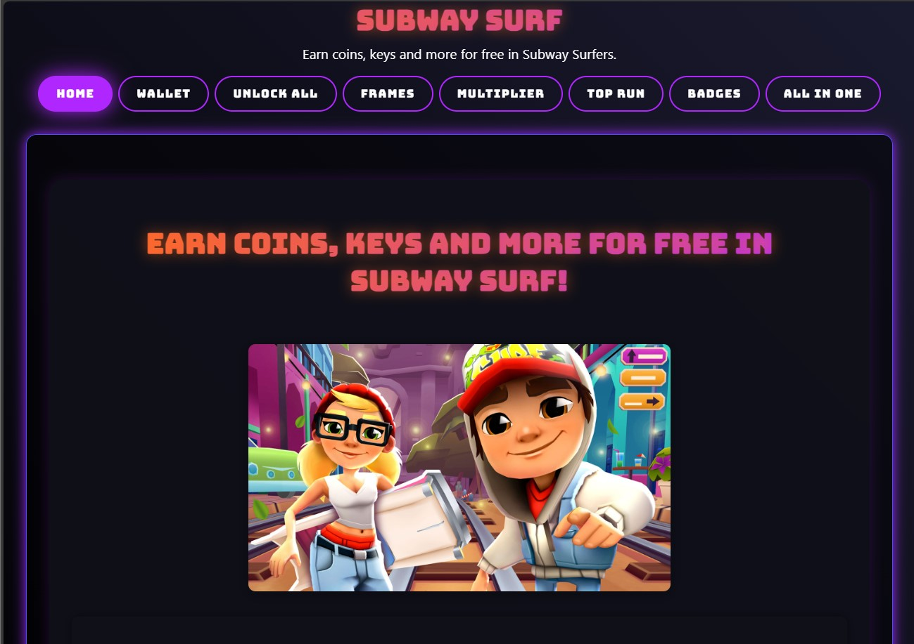
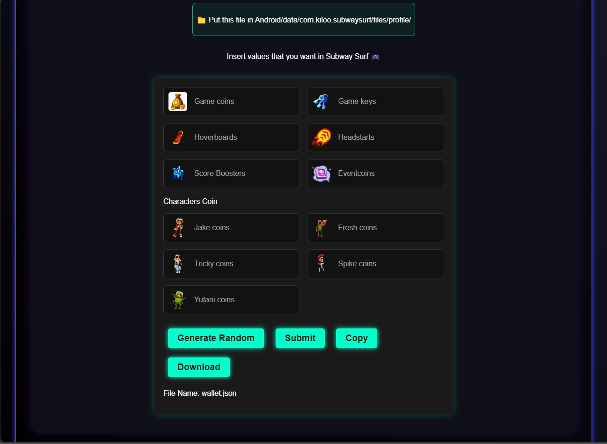

# SubwaySurf-Temp

Earn coins, keys, and more for free in Subway Surfers.

---

## Features

- **Wallet Management**: Manage your in-game wallet.
- **Unlock All Items**: Unlock all in-game items and frames.
- **Multiplier Tool**: Boost your in-game multipliers.
- **Badges and Top Runs**: Tempering High Score and achievements.
- **Decrypt JSON**: Decrypt in-game JSON data.
- **All-in-One**: Downloaded the Zip file and extract its contents into the game folder.

## Preview

 
  

## About

This project is created and maintained by **Sayfullah**. Feel free to explore, suggest improvements, or contribute via pull requests.

**Idea Credit: [just-exploit](https://github.com/just-exploit/SubwayHackWEB) and [HerrErde](https://github.com/HerrErde/subway_gen)**.

**Decrypt API: [subwaySurfers-ezGUI](https://github.com/lea0o0oo/subwaySurfers-ezGUI)**.

## License

This project is licensed under the [MIT License](LICENSE).

